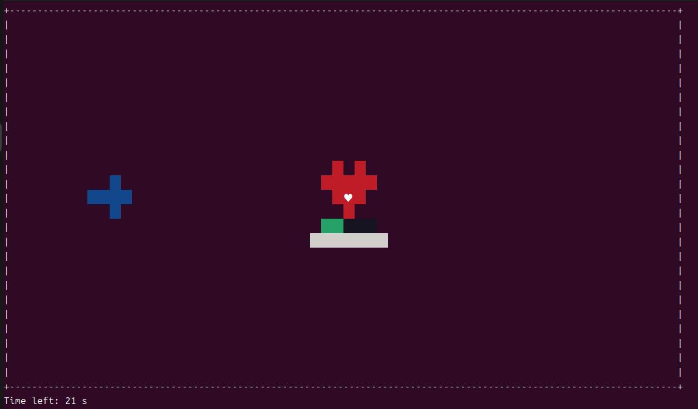
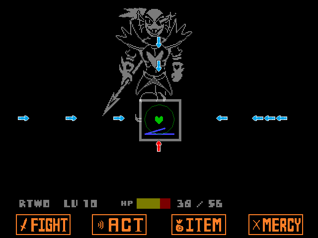

# 113703013-OOP-assign7
-A hand-in for assignment7 of NCCU's 2025OOP by 113703013

-Based on assign 5&6
#Preview

-Red heart is the player while Green bar below it is HP bar(5 HP by default).

-Player can control the direction that the shield(white bar) face by WASD to guard attack(1 DMG by default).

-Win/Lose conditions: Survive 30 seconds to win the game before run out of HP. 

#Others
-Workflow chart:
![pics]
-UML Class diagram:
![pics]
-Inspired by Undyne's fight in the video game Undertale.

